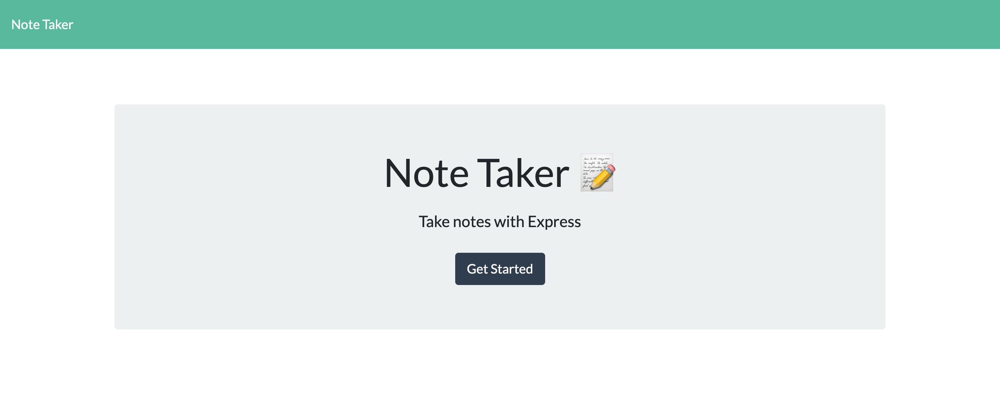

# Note Taker

  ## License
  ------------------
   https://opensource.org/licenses/MIT
  
  ## Image Preview

  ## Table of Contents
  - [Description](#description)
  - [Usage](#usage)
  - [Github](#github)
  - [Email](#email)
  - [Repository](repository)

##  Description
------------------

App that take Note and save

## Usage
------------------
- HTML/CSS/Javascript
- Node.js
    - path
    - fs
- NPM Express

## Contact
------------------
Github account : deashawnogle 
Email : deashawnogle@gmail.com 
Github Repository : <a href="https://github.com/deashawnogle">deashawnogle</a>

## Deployed Link
<a href ="https://daesangnotetaker.herokuapp.com/">
https://daesangnotetaker.herokuapp.com/
</a>

